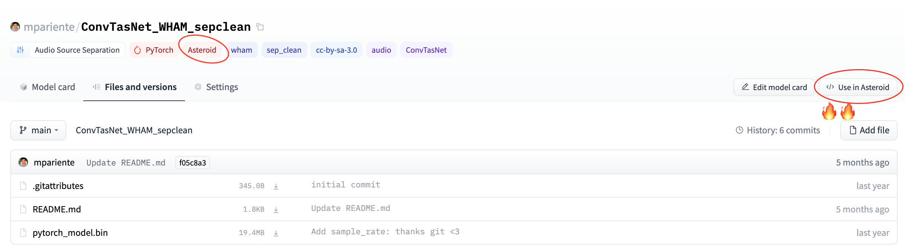
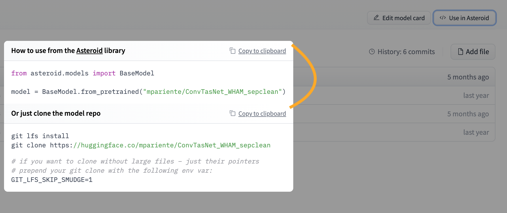

# `huggingface_hub`

## Welcome to the Hub repo! Here you can find all the open source things related to the Hugging Face Hub.

	
	
	

What can you find in this repo?

* [`huggingface_hub`](https://github.com/huggingface/huggingface_hub/tree/main/src/huggingface_hub), a client library to download and publish on the Hugging Face Hub as well as extracting useful information from there.
* [`api-inference-community`](https://github.com/huggingface/huggingface_hub/tree/main/api-inference-community), the Inference API for open source machine learning libraries.
* [`js`](https://github.com/huggingface/huggingface_hub/tree/main/js), the open sourced widgets that allow people to try out the models in the browser.
  * [`interfaces`](https://github.com/huggingface/huggingface_hub/tree/main/js/src/lib/interfaces), Typescript definition files for the Hugging Face Hub.
* [`docs`](https://github.com/huggingface/huggingface_hub/tree/main/docs), containing the official [Hugging Face Hub documentation](https://hf.co/docs).

## The `huggingface_hub` client library

This library allows anyone to work with the Hub repositories: you can clone them, create them and upload your models to them. On top of this, the library also offers methods to access information from the Hub. For example, listing all models that meet specific criteria or get all the files from a specific repo. You can find the library implementation [here](https://github.com/huggingface/huggingface_hub/tree/main/src/huggingface_hub).

 

## Integrating to the Hub.

We're partnering with cool open source ML libraries to provide free model hosting and versioning. You can find the existing integrations [here](https://huggingface.co/docs/hub/libraries).

The advantages are:

- Free model hosting for libraries and their users.
- Built-in file versioning, even with very large files, thanks to a git-based approach.
- Hosted inference API for all models publicly available.
- In-browser widgets to play with the uploaded models.
- Anyone can upload a new model for your library, they just need to add the corresponding tag for the model to be discoverable.
- Fast downloads! We use Cloudfront (a CDN) to geo-replicate downloads so they're blazing fast from anywhere on the globe.
- Usage stats and more features to come.

If you would like to integrate your library, feel free to open an issue to begin the discussion. We wrote a [step-by-step guide](https://huggingface.co/docs/hub/adding-a-library) with ❤️ showing how to do this integration.

 

## Inference API integration into the Hugging Face Hub

In order to get a functional Inference API on the Hub for your models (and thus, cool working widgets!) check out this [doc](https://github.com/huggingface/huggingface_hub/tree/main/api-inference-community). There is a docker image for each library. Within the image, you can find the implementation for supported pipelines for the given library.

 

## Widgets

All our widgets are open-sourced. Feel free to propose and implement widgets. You can try all of them out [here](https://huggingface-widgets.netlify.app/).

 

## Code Snippets

We'll implement a few tweaks to improve the UX for your models on the website – let's use [Asteroid](https://github.com/asteroid-team/asteroid) as an example.

Model authors add an `asteroid` tag to their model card and they get the advantages of model versioning built-in

We add a custom "Use in Asteroid" button. When clicked, you get a library-specific code sample that you'll be able to specify. 🔥

 

## Feedback (feature requests, bugs, etc.) is super welcome 💙💚💛💜♥️🧡
