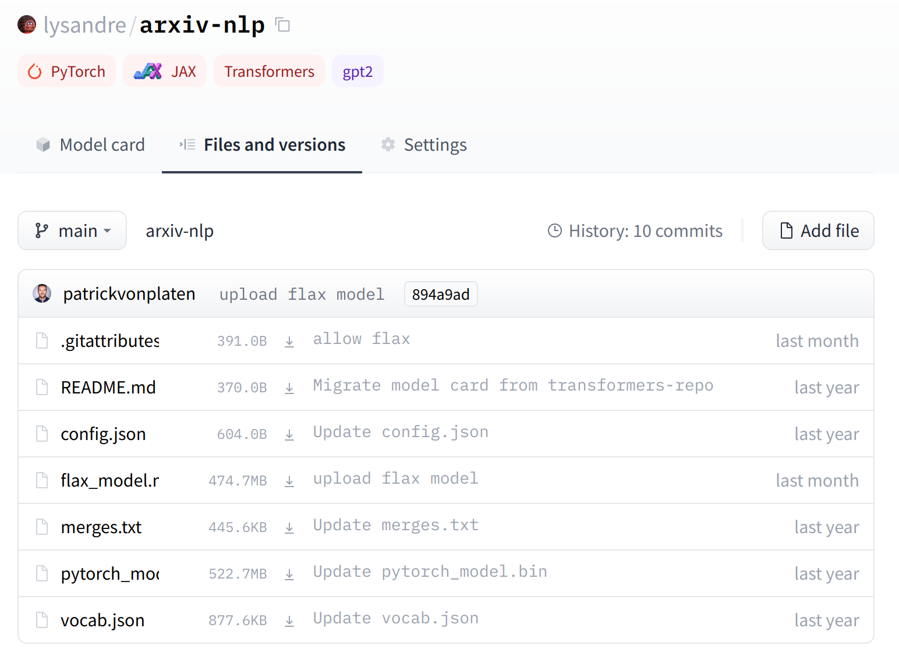

# Integrating your library to the Hub

## Introduction

The Hugging Face Hub aims to facilitate the sharing of machine learning models, checkpoints, and artifacts.  This endeavor starts with the integration of its tool stack within downstream libraries, and we're happy to announce  the fruitful collaboration between Hugging Face and spaCy, AllenNLP, and Timm, among many other incredible libraries.

**For a full list of supported libraries, see [the following table](/docs/libraries).**

We believe the Hub is a step in the correct direction for several reasons. It offers:

- Free model hosting for libraries and their users.
- Built-in file versioning, even with very large files, thanks to a git-based approach.
- Hosted inference API for all models publicly available.
- In-browser widgets to play with the uploaded models (you can read more about the widgets [here](/docs#whats-a-widget)).

Thanks to these, we hope to achieve true shareability across the machine learning ecosystem, reproducibility, 
and the ability to offer simple solutions directly from the browser. To that end, we're looking to make it very 
simple to integrate the Hub within downstream libraries or standalone machine learning models.

In order to provide help in the integration, feel free to open an issue in the Hub [repository](https://github.com/huggingface/huggingface_hub) so we can track and discuss about the process.

The approach can be split in three different steps:

1. The "downstream" approach: downloading files from the Hub so that they may be used easily locally from your library.
2. The "upstream" approach: creating repositories and uploading files to the Hub directly from your library.
3. Setting up the inference API for uploaded models, allowing users to try out the models directly in the browser.

Before getting started, we recommend you first [create a Hugging Face account](/join). This will create a namespace on which you can create repositories and to which you can upload files to. If your library already has a set of pretrained models, you can create an organization where users would find the canonical models.

Once your account is created, jump to your environment with the `huggingface_hub` library installed and log in:

```bash
huggingface-cli login
```

```bash
        _|    _|  _|    _|    _|_|_|    _|_|_|  _|_|_|  _|      _|    _|_|_|      _|_|_|_|    _|_|      _|_|_|  _|_|_|_|
        _|    _|  _|    _|  _|        _|          _|    _|_|    _|  _|            _|        _|    _|  _|        _|
        _|_|_|_|  _|    _|  _|  _|_|  _|  _|_|    _|    _|  _|  _|  _|  _|_|      _|_|_|    _|_|_|_|  _|        _|_|_|
        _|    _|  _|    _|  _|    _|  _|    _|    _|    _|    _|_|  _|    _|      _|        _|    _|  _|        _|
        _|    _|    _|_|      _|_|_|    _|_|_|  _|_|_|  _|      _|    _|_|_|      _|        _|    _|    _|_|_|  _|_|_|_|

        
Username: 
Password:
```

You're now ready to go!

## Downstream: fetching files from the hub

The downstream approach is managed by the [`huggingface_hub`](https://github.com/huggingface/huggingface_hub/tree/main/src/huggingface_hub) library. Three methods may prove helpful when trying to 
retrieve files from the hub:

### `hf_hub_url`

This method can be used to construct the URL of a file from a given repository. For example, the 
repository [`lysandre/arxiv-nlp`](https://huggingface.co/lysandre/arxiv-nlp) has a few model, configuration and tokenizer files:




We would like to specifically fetch the configuration file of that model. The `hf_hub_url` method is tailored for 
that use-case especially:

```python
>>> from huggingface_hub import hf_hub_url
>>> hf_hub_url("lysandre/arxiv-nlp", filename="config.json")
'https://huggingface.co/lysandre/arxiv-nlp/resolve/main/config.json'
```


This method is powerful: it can take a revision and return the URL of a file given a revision, which is the same 
as clicking on the "Download" button on the web interface. This revision can be a branch, a tag or a commit hash:

```python
>>> hf_hub_url("lysandre/arxiv-nlp", filename="config.json", revision="877b84a8f93f2d619faa2a6e514a32beef88ab0a")
'https://huggingface.co/lysandre/arxiv-nlp/resolve/877b84a8f93f2d619faa2a6e514a32beef88ab0a/config.json'
```

### `cached_download`

This method works hand in hand with the `hf_hub_url` method. Pass it a URL, and it will retrieve and *cache* the 
file! Let's try it with the configuration file we just retrieved thanks to the `hf_hub_url` method:

```python
>>> from huggingface_hub import hf_hub_url, cached_download
>>> config_file_url = hf_hub_url("lysandre/arxiv-nlp", filename="config.json")
>>> cached_download(config_file_url)
'/home/lysandre/.cache/huggingface/hub/bc0e8cc2f8271b322304e8bb84b3b7580701d53a335ab2d75da19c249e2eeebb.066dae6fdb1e2b8cce60c35cc0f78ed1451d9b341c78de19f3ad469d10a8cbb1'
```

The file is now downloaded and stored in my cache: `~/.cache/huggingface/hub`. It isn't necessarily noticeable for 
small files such as a configuration file - but larger files, such as model files, would be hard to work with if they 
had to be re-downloaded every time. Additionally, these large files will always be downloaded with a blazing fast
download speed: we use Cloudfront (a CDN) to geo-replicate downloads across the globe. ⚡⚡

If the repository is updated with a new version of the file we just downloaded, then the `huggingface_hub` will 
download the new version and store it in the cache next time, without any action needed from your part to specify 
it should fetch an updated version.

### `snapshot_download`

The `hf_hub_url` and `cached_download` combo works wonders when you have a fixed repository structure; for example 
a model file alongside a configuration file, both with static names.

However, this is not always the case. You may choose to have a more flexible approach without sticking to a specific 
file schema. This is what the authors of `AllenNLP` and `Sentence Transformers` chose to do for instance. In that case `snapshot_download` comes 
in handy: it downloads a whole snapshot of a repo's files at the specified revision, without having to have git or git-lfs installed. All files are nested inside a 
folder in order to keep their actual filename relative to that folder.

This is similar to what you would obtain if you were to clone the repository yourself - however, this does not 
need either git or git-lfs to work, and none of your users will need it either.

```python
>>> from huggingface_hub import snapshot_download
>>> snapshot_download("lysandre/arxiv-nlp")
'/home/lysandre/.cache/huggingface/hub/lysandre__arxiv-nlp.894a9adde21d9a3e3843e6d5aeaaf01875c7fade'
```

The downloaded files are, once again, cached on your system. The code above will only need to fetch the files the 
first time it is run; and if you update a file on your repository, then that method will automatically fetch the 
updated repository next time it is run.

### Finalizing the downstream approach

With the help of these three methods, implementing a download mechanism from the hub should be super simple! Please, 
feel free to open an issue if you're lost as to how apply it to your library - we'll be happy to help.

### Code sample

For users to understand how the model should be used in your downstream library, we recommend adding a code snippet 
explaining how that should be done. 


In order to do this, please take a look and update the following file with 
mentions of your library: [interfaces/Libraries.ts](https://github.com/huggingface/huggingface_hub/blob/main/interfaces/Libraries.ts). 
This file is in Typescript as this is the ground truth that we're using on the Hugging Face website. A good 
understanding of Typescript isn't necessary to edit the file.

Additionally, this will add a tag with which users may filter models. All models from your library will 
be easily identifiable!


## Upstream: creating repositories and uploading files to the hub

The `huggingface_hub` library offers a few tools to make it super simple to create a repository on the hub 
programmatically, and upload files to that repository. 

We'll see two approaches, that work slightly differently.
- The `HfApi` class
- The `Repository` class.

### `HfApi`

The `HfApi` class is a low level class that acts as a thin wrapper around HTTP requests. It has no dependency
other than `requests`, and can handle repository creation and deletion, repository visibility, model search, as well
as file uploads.

```python
>>> from huggingface_hub import HfApi
>>> api = HfApi()
```

This class contains a few methods we're interested in: `create_repo` and `upload_file`.

While up to now we didn't need any authorization token to download files from public repositories, we will 
need one to create a repository and upload files to it. You can retrieve your token using the `HfFolder`:

```python
>>> from huggingface_hub import HfFolder
>>> folder = HfFolder()
>>> token = folder.get_token()
```

#### `create_repo`

The `create_repo` method may be used to create a repository directly on the model hub. Once you have your 
token in hand

```python
>>> from huggingface_hub import HfApi
>>> api = HfApi()
>>> api.create_repo(token, "test-model")
'https://huggingface.co/lysandre/test-model'
```

You can choose to create repository privately, and to upload it to an organization you are part of.

#### `upload_file`

The `upload_file` method may be used to upload files to a repository directly on the model hub (bypassing git and git-lfs). It needs a 
token, a path to a file, the final path in the repo, as well as the ID of the repo we're pushing to.

```python
>>> api.upload_file(
...	token, 
...	path_or_fileobj="/home/lysandre/dummy-test/README.md", 
...	path_in_repo="README.md", 
...	repo_id="lysandre/test-model"
... )
'https://huggingface.co/lysandre/test-model/blob/main/README.md'
```

### `Repository`

The Repository class is the main way to programmatically push models or other repos to huggingface.co, and it is simply a wrapper over git & git-lfs methods.

Therefore, handling repositories with this class requires you and your users to have git and git-lfs correctly set up.

We recommend taking a look at the 
[class definition directly](https://github.com/huggingface/huggingface_hub/blob/main/src/huggingface_hub/repository.py) 
to see what is possible, as it offers a lot of very useful wrappers.

It offers several methods that can be used directly from a Python runtime, namely:
- `git_add`
- `git_pull`
- `git_commit`
- `git_push`
- A `push_to_hub` which takes care of adding all files to the staging area, commit them and push them to the repo.

### Finalizing the upstream approach

With these two methods, creating and managing repositories is done very simply! When offering uploading possibilities
through your library, we recommend you also set up a workflow to automatically create model cards for your users.

#### Model cards

Model cards are arguably as important as the model and tokenizer files in a model repository. They are the central 
definition of the model, ensuring reusability by fellow community members and reproducibility of results, 
while providing a platform on which other members may build their artifacts.

Without model cards, then the Hugging Face Hub is nothing more than a storage tool; in order to exploit the full
potential of widgets, inference API as well as usability of models, the model cards should be defined.

#### Model card metadata

The metadata held in model cards is the best way to supercharge your model. It is through the metadata that you can
define tags for your library or framework, the type of model uploaded, the language, license, evaluation results,
and more.

The full model card specification can be seen below:
```yaml
---
language:
- {lang_0}  # Example: fr
- {lang_1}  # Example: en
license: {license}  # Example: apache-2.0
tags:
- {tag_0}  # Example: audio
- {tag_1}  # Example: automatic-speech-recognition
- {tag_2}  # Example: speech
- {tag_3}  # Example to specify a library: allennlp
datasets:
- {dataset_0}  # Example: common_voice
metrics:
- {metric_0}  # Example: wer

model-index:  
- name: {model_id}
  results:
  - task: 
      name: {task_name}  # Example: Speech Recognition
      type: {task_type}  # Example: automatic-speech-recognition
    dataset:
      name: {dataset_name}  # Example: Common Voice zh-CN
      type: {dataset_type}  # Example: common_voice
      args: {arg_0}  # Example: zh-CN
    metrics:
      - name: {metric_name}  # Example: Test WER
        type: {metric_type}  # Example: wer
        value: {metric_value}  # Example: 20.90
        args: {arg_0}  # Example for BLEU: max_order
---
```

None of the fields are required - but any added field will improve the discoverability of your model and open it to features such as the inference API. You can find more information on repos and model cards [here](/docs/model-repos).

## Setting up the Inference API

### Docker image

All third-party libraries are dockerized: in this environment, you can install the dependencies you'll need for your 
library to work correctly. In order to add your library to the existing docker images, head over to 
the [`inference-api-community` docker images folder](https://github.com/huggingface/huggingface_hub/tree/main/api-inference-community).

Here, you'll be facing a folder for each library already implemented - as well as a `common` folder. Copy this 
folder and paste it with the name of your library. You'll need to edit three files to make this docker image yours:

- The `requirements.txt` should be defined according to your library's needs.
- The `app/main.py` needs to mention which tasks are implemented. Look for the `IMPLEMENT_THIS` sample and update 
  it accordingly. See [AllenNLP](https://github.com/huggingface/huggingface_hub/blob/59ea9998ee2331acf1c50a9fe2f93e5606c5fefb/api-inference-community/docker_images/allennlp/app/main.py#L29) 
  or [sentence-transformers](https://github.com/huggingface/huggingface_hub/blob/59ea9998ee2331acf1c50a9fe2f93e5606c5fefb/api-inference-community/docker_images/sentence_transformers/app/main.py#L32-L33) 
  for examples.
- Finally, the meat of the changes is to be applied to each pipeline you would like to see enabled for your model. 
  Modify the files `app/pipelines/{task_name}.py` accordingly. Here too, look for the `IMPLEMENT_THIS` sample and 
  edit to fit your needs. While keeping in mind that we aim for our pipelines to be as generic as possible, feel 
  free to add any pipeline you need if it isn't among the others. If you run into any issues, please 
  [open an issue](https://github.com/huggingface/huggingface_hub/issues/new) so that we may take a  look and help 
  you out.

For additional information, please take a look at the README available in the `api-inference-community` [folder](https://github.com/huggingface/huggingface_hub/tree/main/api-inference-community). 
This README contains information about the tests necessary to ensure that your library's docker image will continue working.

### Implementing a widget

All our widgets are [open sourced](https://github.com/huggingface/huggingface_hub/tree/main/widgets)!. You can try them out [here](https://huggingface-widgets.netlify.app/). If you would like to contribute or propose a new widget, please open an issue in the repo.

### New pipelines

If you're adding a new pipeline type, you might also want to take a look at adding it to the 
[Types.ts](https://github.com/huggingface/huggingface_hub/blob/main/interfaces/Types.ts) for it to be identifiable as a possible pipeline.

Secondly, you should set the 
[widget default for that new pipeline](https://github.com/huggingface/huggingface_hub/blob/main/interfaces/DefaultWidget.ts) if you can.
