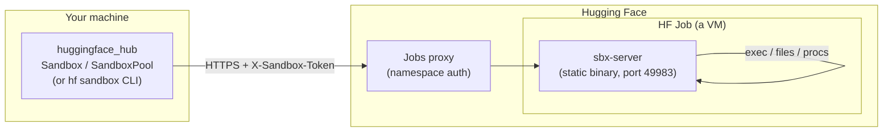
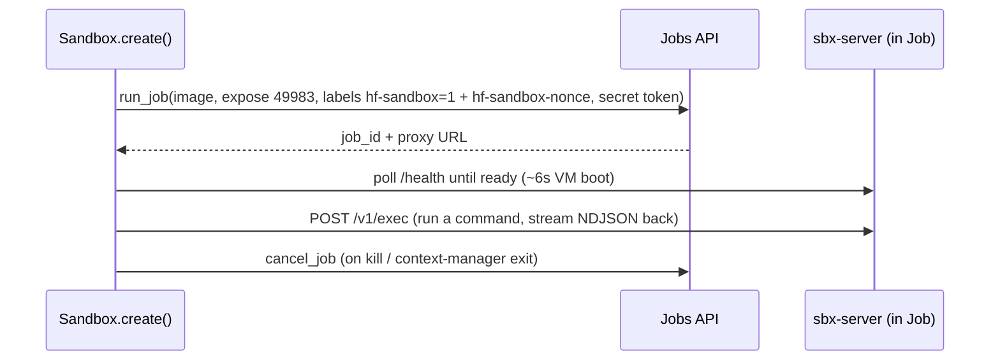
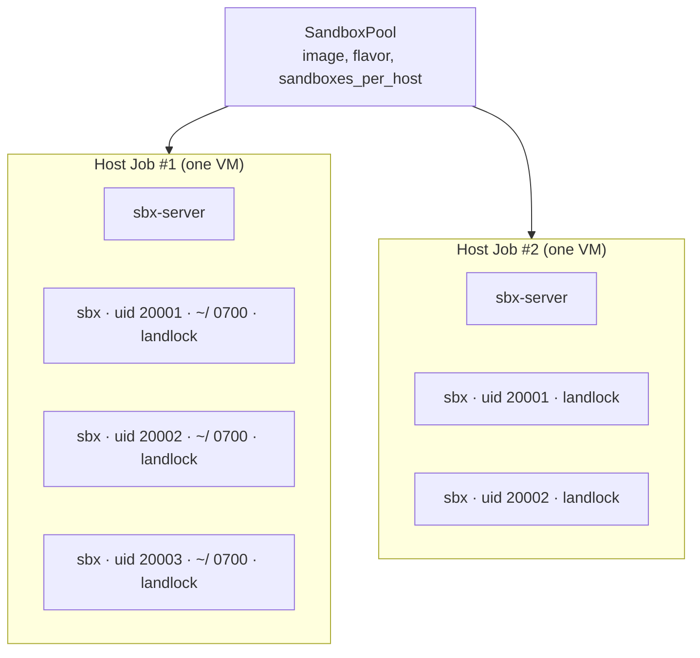
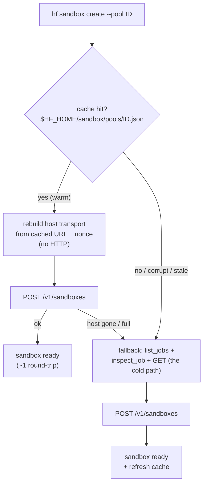

<!--⚠️ Note that this file is in Markdown but contains specific syntax for our doc-builder (similar to MDX) that may not be
rendered properly in your Markdown viewer.
-->
# Sandboxes under the hood

This guide explains how [Sandboxes](../guides/sandbox) work internally, and — just as importantly — *why* they are built the way they are and what their limitations are. If you only want to use sandboxes, the [Sandboxes guide](../guides/sandbox) is enough; read on if you want to understand the mechanism, evaluate the trust model, or debug something.

## There is no "sandbox service"

The first thing to understand is that there is **no dedicated sandbox backend**. A sandbox is just an [HF Job](../guides/jobs) (a VM) running a single small static binary — `sbx-server` — that speaks HTTP. The client talks to that server through the **Jobs proxy** (the `*.hf.jobs` URL the Job exposes). Everything else — authentication, discovery, packing many sandboxes into one Job — is built out of existing Jobs primitives: labels, environment variables, and secrets.



This "no new infrastructure" design is the reason a sandbox works in any Docker image and inherits Jobs' billing, hardware flavors, and namespace permissions for free.

### Bootstrapping the server

At job startup, the Job's command is a small `/bin/sh -c` script that fetches the `sbx-server` binary, makes it executable, and `exec`s it. The binary is a ~640KB static [musl](https://musl.libc.org/) build with zero runtime dependencies, so it runs in any `x86_64` Linux image.

A few decisions worth calling out:

- **Download, with a mount fallback.** The fast path downloads the binary from the HF CDN with `wget` or `curl` (every common base image ships one), which is fast and free. As a safety net, the server's Hub repo is *also* mounted on every job as a volume: if the image has neither `wget` nor `curl`, the script copies the binary off that mount instead. The mount is transparent — it costs nothing unless actually read — but reading it adds ~2-3s to cold start (and drops the executable bit, hence the `chmod`), so it's a fallback, not the default. The only hard requirement on the image is `/bin/sh`.
- **A hand-rolled HTTP/1.1 server, no framework.** Live output streaming requires flushing each chunk as it is produced. Common minimal Rust HTTP servers (e.g. `tiny_http`) buffer chunked responses until the response completes, which breaks streaming (verified). The server therefore implements HTTP/1.1 by hand: NDJSON event streams for `exec`, raw bodies for files, an explicit flush per chunk.
- **Port 49983.** The server listens on a deliberately uncommon port so that the common dev ports (3000, 8000, 8080, …) stay free for your own code.

> [!TIP]
> The server is open source at [github.com/Wauplin/sandbox-server](https://github.com/Wauplin/sandbox-server).

## Authentication is stateless

Two independent layers protect a sandbox:

1. **The proxy gate.** The Jobs proxy only forwards requests carrying an HF token with read access to the job's namespace. A random member of the internet cannot reach the URL.
2. **The application gate.** `sbx-server` additionally checks a per-sandbox `X-Sandbox-Token` on every request (in constant time). This is defense in depth: a read-only namespace member who can reach the proxy still cannot execute commands.

The per-sandbox token is **derived, not stored**:

```text
nonce  = random 128-bit hex                       # stored in the job label "hf-sandbox-nonce"
token  = HMAC-SHA256(key=your_hf_token, msg="hf-sandbox:" + nonce)
```

Every sandbox job also carries two stable labels for discovery — `hf-sandbox=1` (on all of them) and `hf-sandbox-mode=dedicated` or `hf-sandbox-mode=pool` — so you can list or filter them server-side, e.g. `hf jobs ps --label hf-sandbox=1`.

The token is delivered to the server via a Job **secret** (encrypted, never in the command line or logs). The client re-derives it on demand from the public nonce in the label. This has some nice consequences:

- **Stateless reconnection.** [`Sandbox.connect(id)`] works from any machine that holds the same HF token — read the nonce from the label, recompute the token. No local files, no state to copy.
- **The HF token never enters the sandbox** (unless you opt in with `forward_hf_token=True`), so code running inside cannot exfiltrate your credentials.
- **Per-sandbox scope.** Each sandbox has a unique nonce, so a leaked sandbox token compromises that one sandbox only. Other namespace members hold a different HF token and cannot derive it.

## Dedicated sandboxes (`Sandbox.create`)

The straightforward model: **one Job per sandbox**. A Job is a real VM, so this gives the strongest isolation (VM-level), supports any hardware flavor including GPUs, and is the right choice for mutually-untrusted code. Its API routes live at `/v1/*` and file paths are absolute on the container filesystem. `kill()` simply cancels the Job.



The cost is right there in the diagram: every sandbox pays a full ~6s VM cold start and bills a whole machine. For a single sandbox or a GPU workload that is exactly what you want. For 100–1000 short CPU tasks it is wasteful — which is what pools are for.

## Pools: many sandboxes in one Job (`SandboxPool`)

A typical RL rollout or tool-execution sandbox needs a few MB of RAM and one core for a few seconds. Paying a 2-vCPU VM and a 6s cold start *each* — and triggering a 1000-VM scheduling burst — is the wrong trade. So [`SandboxPool`] runs **one Job as a host** and multiplexes many sandboxes inside it.

A pooled sandbox is not a nested VM or container. It is the classic Unix multi-user primitive:

- a **dedicated uid** (≥ 20000),
- a **private `0700` home** owned by that uid,
- commands `exec`'d as that uid with a **scrubbed environment** (`env_clear`, so the host's secrets
  never leak in), `NO_NEW_PRIVS`, per-process **rlimits**, and a per-sandbox **Landlock ruleset**.

Creating a sandbox is therefore `mkdir + chown + build ruleset` ≈ **1ms server-side** — no second VM boot. The only client-visible latency is the proxy round-trip.



A pooled sandbox's public id is `<host_job_id>.<local_id>`, so `connect`/`exec`/`kill` work statelessly just like dedicated ones. `kill()` on a pooled sandbox sends a `DELETE` to its host (freeing a slot); the host keeps running.

### Isolation in a pool: uid + Landlock

This is the crux of the pool design, so it is worth being precise about what is and isn't isolated.

A stock Job runs **as root inside a user namespace that maps only uids 0..65535**, with a seccomp filter on and without `CAP_SYS_ADMIN` / `CAP_NET_ADMIN` / `CAP_NET_RAW`. That rules out the usual heavyweight isolation tools: no nested namespaces, no new mounts, no cgroup delegation (`unshare`, `mount`, writing to `/sys/fs/cgroup/...` all fail). What the kernel *does* offer is [**Landlock**](https://docs.kernel.org/userspace-api/landlock.html) (ABI 6), a Linux Security Module that lets **any unprivileged process restrict itself and its children** — exactly the per-sandbox boundary we need. For each sandbox the server builds a ruleset; the exec child applies `NO_NEW_PRIVS` → `landlock_restrict_self` → rlimits → `setuid/setgid` before running the command.

Combining distinct uids (discretionary access control) with Landlock, and verified live against a hostile sandbox A attacking a victim B, gives:

- ✅ A cannot read any process's `environ` → **HF and sandbox tokens never leak** between sandboxes.
- ✅ A cannot `SIGKILL` / `ptrace` / read the memory of B's processes, `setuid` into B, or read B's
  `0700` home.
- ✅ `/tmp` and `/dev/shm` access is denied — each sandbox is Landlock-confined to its own home (its
  `TMPDIR` points inside `$HOME`).
- ✅ A cannot `bind` a TCP port, so there is no inter-sandbox localhost service (outbound `connect`
  stays allowed, so the internet works).
- ✅ Cross-sandbox abstract unix sockets are blocked (`LANDLOCK_SCOPED_ABSTRACT_UNIX_SOCKET`; uid
  isolation alone does *not* block these).

> [!WARNING]
> **Why this is not a substitute for a VM.** Landlock + uid isolation is fast and unprivileged, but it shares one kernel and one VM. Two gaps remain, acceptable only under a *same-user* trust model:
>
> - **Resource DoS.** Without cgroup delegation, CPU / total RAM / disk are not partitioned. `RLIMIT_NPROC` and `RLIMIT_AS` bound per-process usage, but an aggressive sandbox can still starve its neighbours or trip the global OOM killer.
> - **Process-list metadata.** A sandbox can *see* other processes via `/proc` (names, cmdlines) — it just cannot read or signal them. Hiding them would need a PID namespace, which `unshare` can't create here.
>
> In short: confidentiality and integrity between pooled sandboxes are enforced; only availability (DoS) and process-list metadata are shared. That is the right boundary for **one user's own** parallel workloads. For **mutually-hostile untrusted code** — or for GPU — use [`Sandbox.create`], which gives each sandbox its own VM.

### The file model in a pool

Because a pooled sandbox's only writable area is its Landlock-confined home (which is also its default working directory), the file API roots every path at that home: `files.write("data/in.txt", ...)` writes to `$HOME/data/in.txt`, a leading `/` is taken relative to the home, and `..` cannot escape it. Files written through the API are `chown`ed to the sandbox's uid so the sandbox's own code can read them. This gives a clean "filesystem rooted at the sandbox" model that matches exactly what code inside the sandbox can touch — and differs from dedicated sandboxes, where paths are absolute on the container filesystem.

### Pools have no authoritative local state

A pool is deliberately **not** a local config file. A pool *is* its set of running host Jobs, all sharing an `hf-sandbox-pool=<id>` label. This keeps pools consistent with the rest of the sandbox API (everything is discoverable from labels and reattachable from any machine), and it means a pool simply **stops existing once its last host is gone**.

- A host carries the pool's config (image, flavor, `sandboxes_per_host`, idle timeout) in its **job nv vars** — labels are used only for filtering. When a client must boot a duplicate host, it reads that config back from a running host (`inspect_job`), so all hosts in a pool stay consistent without a central record.
- **Env and secrets are per-sandbox**, passed at create time — never pool-level. No secret is ever stored on a host or kept on disk locally.
- **Capacity is server-authoritative.** A host refuses creates beyond `sandboxes_per_host` (replying `{"rejected": N}`); the client packs the overflow onto another host or boots a duplicate. This keeps packing exact even when several processes create into the same pool concurrently.
- **Idle eviction is two-level.** Each sandbox is evicted after its own `idle_timeout` of inactivity (unless it still has a running process); once a host has had no sandboxes for the host idle timeout, it shuts itself down — a billing backstop even if every client disappears.

### A best-effort cache keeps `create --pool` fast

Having no authoritative local state is great for correctness but costs latency. A cold `hf sandbox create --pool <id>` (a fresh CLI process) would otherwise have to rediscover everything over the network before it can create a sandbox: `list_jobs` to scan the namespace → `inspect_job` each host to rebuild its URL and nonce → `GET /v1/sandboxes` to see how full each is → finally `POST` to create. Several round-trips of pure overhead, on every call.

A **best-effort cache** at `$HF_HOME/sandbox/pools/<pool-id>.json` removes that. After any create/warm, a process records the pool config plus, per host, its proxy URL, auth nonce, and last-seen free slots. The next process rebuilds the host transport straight from the file (no HTTP) and goes directly to the `POST`.



The cache is safe precisely because it is never trusted as truth:

- **Never a source of truth.** The in-job server stays authoritative on capacity, so a stale `live` count only ever costs a wasted request, never correctness.
- **Self-healing.** A cached host that is gone is dropped on the first failed request and pruned from the file; the create transparently falls back to label discovery.
- **Concurrency-safe.** Writes merge under a file lock (keyed by `job_id`) and commit atomically, so parallel `create` processes don't clobber each other and readers never see a half-written file.
- **Disposable.** Delete it, corrupt it, or run from a machine that has never seen the pool — it is simply a cache miss, the cold path runs, and everything still works. It is never shared across machines.

The cache only ever makes things **faster, never slower**: the worst case is exactly the original label-discovery path.

## Performance

All numbers are measured against real HF Jobs on `cpu-basic`, with the client on a laptop and all traffic flowing through the Jobs proxy.

**Dedicated sandbox:**

| metric                                            | value                                                           |
| ------------------------------------------------- | --------------------------------------------------------------- |
| cold start (`create()` returns, server answering) | ~5.8s median                                                    |
| `run()` round-trip                                | p50 ~110ms (the proxy RTT floor is ~105ms; client overhead ≈ 0) |
| file transfer (parallel ranged, >8 MiB)           | ~340 MiB/s down, ~441 MiB/s up                                  |

**Pool (shared/host mode):**

| N sandboxes | hosts (50/host) | provision + create all | exec in all | kill all | total     |
| ----------- | --------------- | ---------------------- | ----------- | -------- | --------- |
| 100         | 2               | 6.1s                   | 1.5s        | 0.6s     | **8.2s**  |
| 1000        | 20              | 7.4s                   | 4.2s        | 4.2s     | **15.8s** |

1000 sandboxes created, exec'd and killed in ~16s cost roughly one host cold start (~6s) amortized across all of them — about **$0.0009** total (20 × `cpu-basic`), versus ~$0.06 and a 1000-VM scheduling burst for one Job per sandbox. Server-side create/exec/delete are each ~1ms; the budget is entirely the network round-trip.

## Design decisions, recap

| decision                                                              | why                                                                             |
| --------------------------------------------------------------------- | ------------------------------------------------------------------------------- |
| Build on Jobs, no new service                                         | inherits billing, hardware, permissions; works in any image                     |
| Static Rust binary, downloaded at startup                             | no Python/pip; ~6s cold start vs 30–90s for a pip-based bootstrap               |
| Hand-rolled HTTP/1.1                                                  | minimal frameworks buffer chunked responses and break live streaming (verified) |
| Stateless HMAC auth                                                   | reconnect from anywhere; HF token never enters the sandbox                      |
| `run()` raises on non-zero exit (`check=False` opts out)              | best DX for "run code, see the error" loops (E2B-style)                         |
| `idle_timeout` watchdog instead of client-side cleanup                | persistent sandboxes are a feature; leaked ones still die                       |
| Pools = uid + Landlock, server-authoritative capacity, no local state | fast same-user fan-out; correct under concurrency; reattachable anywhere        |

## Limitations and future work

- **No GPU in pools** — pooled sandboxes are CPU-only; use [`Sandbox.create`] for GPU.
- **No resource (cgroup) isolation in pools** — a pooled sandbox can DoS its neighbours; not suitable for mutually-hostile code. Optional cgroup caps are on the roadmap.
- **Images without `/bin/sh`** (e.g. distroless) are unsupported.
- **Fixed lifetime.** A Job's max lifetime is set at creation; there is no way to extend a running sandbox today (the `idle_timeout` watchdog only shortens it).
- **No pause/resume or filesystem snapshots** — these need Jobs support that does not exist yet.
- **Roadmap:** an official versioned home for the server binary (arm64 build, protocol pinning), an interactive PTY shell (`hf sandbox shell` over WebSocket, already proven through the proxy), an async client, and directory upload.
