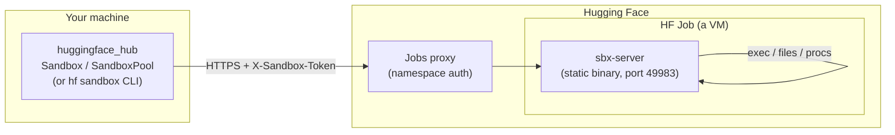
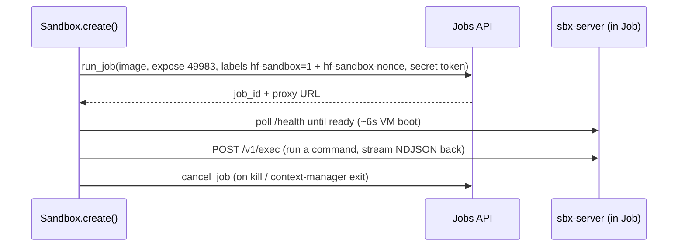
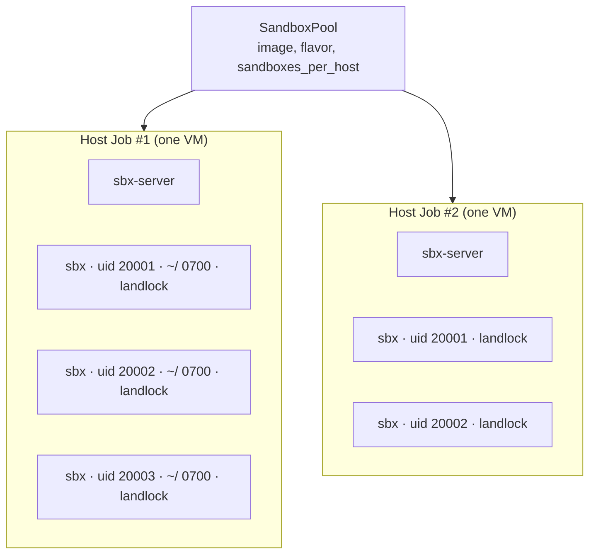
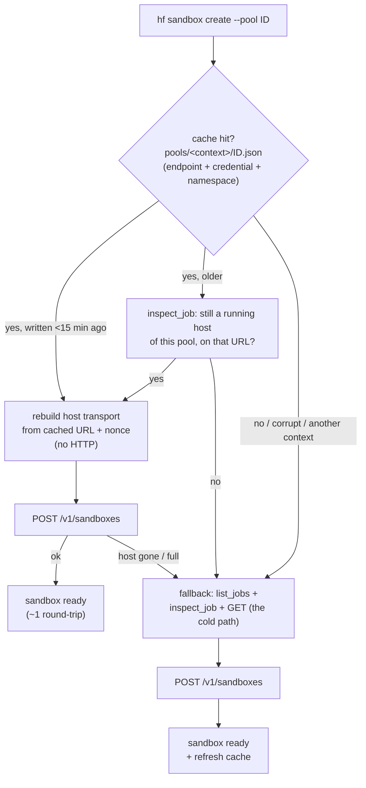

<!--⚠️ Note that this file is in Markdown but contains specific syntax for our doc-builder (similar to MDX) that may not be
rendered properly in your Markdown viewer.
-->
# Sandboxes under the hood

This guide explains how [Sandboxes](../guides/sandbox) work internally, and why they are built the way they are and what their limitations are. If you only want to use sandboxes, the [Sandboxes guide](../guides/sandbox) is enough; read on if you want to understand the mechanism, evaluate the trust model, or debug something.

> [!NOTE]
> The Sandbox API is experimental. Its API and behavior may change without notice.

## There is no "sandbox service"

The first thing to understand is that there is no dedicated sandbox backend. A sandbox is just an [HF Job](../guides/jobs) (a VM) running a single small static binary `sbx-server` that speaks HTTP. The client talks to that server through the Jobs proxy (the `*.hf.jobs` URL the Job exposes). Everything else — authentication, discovery, packing many sandboxes into one Job — is built out of existing Jobs primitives: labels, environment variables, and secrets.


```mermaid
flowchart LR
    subgraph local["Your machine"]
        C["huggingface_hub<br/>Sandbox / SandboxPool<br/>(or hf sandbox CLI)"]
    end
    subgraph hf["Hugging Face"]
        P["Jobs proxy<br/>(namespace auth)"]
        subgraph job["HF Job (a VM)"]
            S["sbx-server<br/>(static binary, port 49983)"]
        end
    end
    C -- "HTTPS + X-Sandbox-Token" --> P
    P --> S
    S -- "exec / files / procs" --> S
```

This "no new infrastructure" design is the reason a sandbox works in any Docker image and inherits Jobs' billing, hardware flavors, and namespace permissions for free.

### Bootstrapping the server

At job startup, the Job's command is a small `/bin/sh -c` script that fetches the `sbx-server` binary, makes it executable, and `exec`s it. The binary is a ~640KB static [musl](https://musl.libc.org/) build with zero runtime dependencies, so it runs in any `x86_64` Linux image.

A few decisions worth calling out:

- **Download, with a mount fallback.** The fast path downloads the binary from the HF CDN with `wget` or `curl` (every common base image ships one), which is fast and free. As a safety net, the server's Hub repo is also mounted on every job as a volume: if the image has neither `wget` nor `curl`, the script copies the binary off that mount instead. The mount is transparent — it costs nothing unless actually read — but reading it adds ~2-3s to cold start, hence why it's not the default. The only hard requirement on the image is `/bin/sh`.
- **A hand-rolled HTTP/1.1 server, no framework.** Live output streaming requires flushing each chunk as it is produced. Common minimal Rust HTTP servers (e.g. `tiny_http`) buffer chunked responses until the response completes, which breaks streaming. The server therefore implements HTTP/1.1 by hand: NDJSON event streams for `exec`, raw bodies for files, an explicit flush per chunk.
- **Port 49983.** The server listens on a deliberately uncommon port so that the common dev ports (3000, 8000, 8080, …) stay free for your own code.

> [!TIP]
> The server is open source at [github.com/huggingface/sandbox-server](https://github.com/huggingface/sandbox-server).

## Authentication is stateless

Two independent layers protect a sandbox:

1. **The proxy gate.** The Jobs proxy only forwards requests carrying an HF token with read access to the job's namespace. A random member of the internet cannot reach the URL.
2. **The application gate.** `sbx-server` additionally checks an `X-Sandbox-Token` header on every request except `/health`. This is defense in depth: a read-only namespace member who can reach the proxy still cannot execute commands.

The sandbox token is derived, not stored:

```text
nonce  = random 128-bit hex                       # stored in the job label "hf-sandbox-nonce"
token  = HMAC-SHA256(key=your_hf_token, msg="hf-sandbox:" + nonce)
```

The nonce is public and the HMAC key is your HF token, so any machine holding that token can recompute the sandbox token — that is exactly what makes reconnection stateless. It also means the token is a *capability* derived from your credential, not an identity check on the caller: the server verifies that the caller knows the token, not who they are.

Every sandbox job also carries two stable labels for discovery — `hf-sandbox=1` (on all of them) and `hf-sandbox-mode=dedicated` or `hf-sandbox-mode=pool` — so you can list or filter them server-side, e.g. `hf jobs ps --label hf-sandbox=1`.

The token is delivered to the server via a Job secret. The client re-derives it on demand from the public nonce in the label. This has some nice consequences:

- **Stateless reconnection.** [`Sandbox.connect(id)`] works from any machine that holds the same HF token — read the nonce from the label, recompute the token. No local files, no state to copy.
- **The HF token is not passed to the sandbox as an environment variable or job secret** (unless you opt in with `forward_hf_token=True`). This is not a hard guarantee that your credentials stay out of reach: the process listening on the sandbox port is whatever the image starts first, so an untrusted image may be able to observe the requests the client sends — including their `Authorization` header. Treat credentials reachable from a sandbox as potentially exposed to it.

### Token scope

One nonce is minted per **Job**, so the derived token is a *job* credential. In dedicated mode the job is the sandbox, so the two coincide. In pool mode the job is the host, and a host holds many sandboxes — so a pooled sandbox gets a second, narrower credential of its own:

| credential | derived how | authorizes |
| --- | --- | --- |
| **dedicated sandbox token** | `HMAC(hf_token, nonce)` from the job's label | that sandbox (which is the whole job) |
| **pool host token** | `HMAC(hf_token, nonce)` from the host job's label | pool management: create, list and delete sandboxes on that host, and recover their tokens |
| **pooled sandbox token** | random 256 bits, minted by the host server per sandbox | that one sandbox — not a sibling, not the pool |

The client uses the narrow one automatically: `pool.create()` receives it in the create response, `Sandbox.connect("<host>.<id>")` recovers it with the host token, and [`proxy_headers`] hands out the sandbox's token rather than the host's (resolving the HF bearer at the moment you read it, so a long-lived handle does not hand out a stale one) — those headers usually end up in a browser or WebSocket client, so they should confer access to one sandbox and nothing more.

What this means for a leak: a **pooled sandbox token** compromises that sandbox. A **host token** compromises the host — every sandbox on it, current and future, plus its management routes — so treat it as the pool's admin credential. Members of your namespace hold a different HF token and cannot derive yours, but see [Known limitations](#known-limitations) for how a token can be *delivered* to the wrong place.

The client requires a non-empty sandbox-scoped token for pooled operations and refuses
hosts that do not provide one. It never substitutes the host-management credential.
Upgrade the client and recycle older pool hosts before using this API.

## Dedicated sandboxes (`Sandbox.create`)

The straightforward model: **one Job per sandbox**. A Job is a real VM, so this gives the strongest isolation (VM-level), supports any hardware flavor including GPUs, and is the right choice for mutually-untrusted code. Its API routes live at `/v1/*` and file paths are absolute on the container filesystem. `kill()` simply cancels the Job.

The boundary a dedicated sandbox gives you is between the **Job and everything outside it**. Inside the VM, your code and `sbx-server` both run as root in the same container: `sbx-server` does not sandbox the command it runs for you, it only exposes it over HTTP. So once code you don't trust has executed in a dedicated sandbox, treat that VM — including its control plane — as belonging to that code: it can kill or replace the server, and anything you do in that sandbox afterwards runs at its mercy. Use one dedicated sandbox per untrusted workload and `kill()` it when done, rather than reusing one across trust boundaries.


```mermaid
sequenceDiagram
    participant U as Sandbox.create()
    participant J as Jobs API
    participant S as sbx-server (in Job)
    U->>J: run_job(image, expose 49983, labels hf-sandbox=1 + hf-sandbox-nonce, secret token)
    J-->>U: job_id + proxy URL
    U->>S: poll /health until ready (~6s VM boot)
    U->>S: POST /v1/exec  (run a command, stream NDJSON back)
    U->>J: cancel_job  (on kill / context-manager exit)
```

The cost is right there in the diagram: every sandbox pays a full ~6s VM cold start and bills a whole machine. For a single sandbox or a GPU workload that is exactly what you want. For 100–1000 short CPU tasks it is wasteful — which is what pools are for.

## Pools: many sandboxes in one Job (`SandboxPool`)

> [!WARNING]
> **Pools are for workloads inside one trust boundary.** A pooled sandbox is a uid + a Landlock
> ruleset inside a shared VM, not a VM of its own, and its host runs a privileged control plane
> that all of its sandboxes talk to. Use pools to fan out *your own* code cheaply. For mutually
> distrusting workloads — anything you would not let read your other sandboxes' files — use
> [`Sandbox.create`], which gives each workload its own VM. See
> [Known limitations](#known-limitations) for the specific gaps.

A typical RL rollout or tool-execution sandbox needs a few MB of RAM and one core for a few seconds. Paying a 2-vCPU VM and a 6s cold start each — and triggering a 1000-VM scheduling burst — is the wrong trade. So [`SandboxPool`] runs one Job as a host and multiplexes many sandboxes inside it.

A pooled sandbox is not a nested VM or container. It is the classic Unix multi-user primitive:

- a **dedicated uid** (≥ 20000),
- a **private `0700` home** owned by that uid,
- commands `exec`'d as that uid with a **scrubbed environment** (`env_clear`, so the host's secrets never leak in), `NO_NEW_PRIVS`, per-process **rlimits**, and a per-sandbox **Landlock ruleset**.

Creating a sandbox is therefore `mkdir + chown + build ruleset` ≈ 1ms server-side — no second VM boot. The only client-visible latency is the proxy round-trip.


```mermaid
flowchart TB
    Pool["SandboxPool<br/>image, flavor, sandboxes_per_host"]
    subgraph h1["Host Job #1 (one VM)"]
        S1["sbx-server"]
        b1["sbx · uid 20001 · ~/ 0700 · landlock"]
        b2["sbx · uid 20002 · ~/ 0700 · landlock"]
        b3["sbx · uid 20003 · ~/ 0700 · landlock"]
    end
    subgraph h2["Host Job #2 (one VM)"]
        S2["sbx-server"]
        b4["sbx · uid 20001 · landlock"]
        b5["sbx · uid 20002 · landlock"]
    end
    Pool --> h1
    Pool --> h2
```

A pooled sandbox's public id is `<host_job_id>.<local_id>`, so `connect`/`exec`/`kill` work statelessly just like dedicated ones. `kill()` on a pooled sandbox sends a `DELETE` to its host (freeing a slot); the host keeps running.

### Isolation in a pool: uid + Landlock

This is the crux of the pool design, so it is worth being precise about what is and isn't isolated.

A stock Job runs as root inside a user namespace that maps only uids 0..65535, with a seccomp filter on and without `CAP_SYS_ADMIN` / `CAP_NET_ADMIN` / `CAP_NET_RAW`. That rules out the usual heavyweight isolation tools: no nested namespaces, no new mounts, no cgroup delegation (`unshare`, `mount`, writing to `/sys/fs/cgroup/...` all fail). What the kernel does offer is [**Landlock**](https://docs.kernel.org/userspace-api/landlock.html) (ABI 6), a Linux Security Module that lets any unprivileged process restrict itself and its children — exactly the per-sandbox boundary we need. For each sandbox the server builds a ruleset; the exec child drops to the sandbox uid/gid and applies `NO_NEW_PRIVS`, `landlock_restrict_self`, and rlimits before running the command.

Combining distinct uids (discretionary access control) with Landlock is designed and tested to provide:

- ✅ A cannot read another process's `environ`, preventing direct access to HF and sandbox tokens between sandboxes.
- ✅ A cannot `SIGKILL` / `ptrace` / read the memory of B's processes, `setuid` into B, or read B's
  `0700` home.
- ✅ `/tmp` and `/dev/shm` access is denied — each sandbox is Landlock-confined to its own home (its
  `TMPDIR` points inside `$HOME`).
- ✅ A cannot `bind` a TCP port, so there is no inter-sandbox localhost service (outbound `connect`
  stays allowed, so the internet works).
- ✅ Cross-sandbox abstract unix sockets are blocked (`LANDLOCK_SCOPED_ABSTRACT_UNIX_SOCKET`; uid
  isolation alone does *not* block these).

These controls constrain the workload. The root control plane remains a separate trust boundary: its host-mode file operations refuse symlinks, its socket proxy pins the socket inode and checks the peer uid, and dedicated routes are unavailable in host mode. Residual shared channels are described in [Known limitations](#known-limitations).

> [!NOTE]
> **Why this is not a substitute for a VM.** Landlock and uid isolation are intended for workloads within the same
> trust boundary. Because pooled sandboxes share a kernel, a VM and a control plane, protection from every
> cross-sandbox attack is not guaranteed; resources and some process-list metadata also remain shared. For mutually
> untrusted code, or for GPU, use [`Sandbox.create`], which gives each sandbox its own VM.

### The file model in a pool

Because a pooled sandbox's only writable area is its Landlock-confined home (which is also its default working directory), the file API roots every path at that home: `files.write("data/in.txt", ...)` writes to `$HOME/data/in.txt`, a leading `/` is taken relative to the home, and `..` cannot escape it. Files written through the API are `chown`ed to the sandbox's uid so the sandbox's own code can read them. This gives a clean "filesystem rooted at the sandbox" model that matches exactly what code inside the sandbox can touch — and differs from dedicated sandboxes, where paths are absolute on the container filesystem.

Paths are normalized lexically, then resolved relative to an open home-directory descriptor with symlink refusal on every component. The file API does not follow symlinks, including links within the same home; sandbox code can still use them under its Landlock rules.

### Pools have no authoritative local state

A pool is deliberately not a local config file. A pool is its set of running host Jobs, all sharing an `hf-sandbox-pool=<id>` label. This keeps pools consistent with the rest of the sandbox API (everything is discoverable from labels and reattachable from any machine), and it means a pool simply stops existing once its last host is gone.

- A host carries the pool's config (image, flavor, `sandboxes_per_host`, idle timeout) in its job env vars — labels are used only for filtering. When a client must boot a duplicate host, it reads that config back from a running host (`inspect_job`), so all hosts in a pool stay consistent without a central record.
- Env and secrets are per-sandbox, passed at create time — never pool-level. A pooled sandbox's environment is held in the host server's memory for the sandbox's lifetime (it is re-applied to every command you run); it is never written to disk and never appears in any Job's metadata. There is no encrypted-secrets channel for pooled sandboxes — use `env` and treat those values as "not at rest, but not encrypted either". For values that need the encrypted store, use a dedicated sandbox's `secrets`.
- Capacity is server-authoritative. A host refuses creates beyond `sandboxes_per_host` (replying `{"rejected": N}`); the client packs the overflow onto another host or boots a duplicate. This keeps packing exact even when several processes create into the same pool concurrently.
- Idle eviction is two-level. Each sandbox is evicted after its own `idle_timeout` of inactivity (unless it still has a running process); once a host has had no sandboxes for the host idle timeout, it shuts itself down — a billing backstop even if every client disappears.

### A best-effort cache keeps `create --pool` fast

Having no authoritative local state is great for correctness but costs latency. A cold `hf sandbox create --pool <id>` (a fresh CLI process) would otherwise have to rediscover everything over the network before it can create a sandbox: `list_jobs` to scan the namespace → `inspect_job` each host to rebuild its URL and nonce → `GET /v1/sandboxes` to see how full each is → finally `POST` to create. Several round-trips of pure overhead, on every call.

A best-effort cache at `$HF_HOME/sandbox/pools/<context>/<pool-id>.json` removes that. After any create/warm, a process records the pool config plus, per host, its proxy URL, auth nonce, and last-seen free slots. The next process rebuilds the host transport straight from the file (no HTTP) and goes directly to the `POST`.

`<context>` is a digest of the endpoint, the credential and the namespace the entry was written for — the credential as a fingerprint; your token itself is never written to the cache. Both the directory name and the file carry it, and a read that doesn't match on all three is a plain cache miss, so another user of the machine, another endpoint, or a `connect(pool, namespace="other-org")` gets the cold path instead of hosts that were cached for something else. Files are created `0600`, directories `0700`.


```mermaid
flowchart TD
    start["hf sandbox create --pool ID"] --> rc{"cache hit?<br/>pools/&lt;context&gt;/ID.json<br/>(endpoint + credential + namespace)"}
    rc -- "yes, written &lt;15 min ago" --> seed["rebuild host transport<br/>from cached URL + nonce<br/>(no HTTP)"]
    rc -- "yes, older" --> check["inspect_job: still a running host<br/>of this pool, on that URL?"]
    check -- "yes" --> seed
    check -- "no" --> slow
    seed --> post["POST /v1/sandboxes"]
    post -- "ok" --> done["sandbox ready<br/>(~1 round-trip)"]
    post -- "host gone / full" --> slow
    rc -- "no / corrupt / another context" --> slow["fallback: list_jobs +<br/>inspect_job + GET (the cold path)"]
    slow --> post2["POST /v1/sandboxes"] --> done2["sandbox ready<br/>+ refresh cache"]
```

What the cache is and isn't trusted for:

- **Not authoritative on capacity.** The in-job server stays authoritative, so a stale `live` count only ever costs a wasted request, never a mis-packed host.
- **Not trusted for where a host lives.** A cached URL is only used if it is the HTTPS jobs-proxy URL of the job that same entry names, so a cache file cannot choose the destination your HF bearer and sandbox token are sent to; an entry naming anything else is dropped from the file. Past 15 minutes an entry is no longer credited on its own either: `inspect_job` has to confirm the job is still running, still labelled for this pool, and still on that URL before the transport is built.
- **Not trusted for its shape.** Types and ranges are checked on read, so a hand-edited, truncated or stringly-typed file is a cache miss rather than an error part-way through `create()`.
- **Self-healing.** A cached host that is gone is dropped on the first failed request and pruned from the file; the create transparently falls back to label discovery.
- **Concurrency-safe.** Writes merge under a file lock (keyed by `job_id`) and commit atomically, so parallel `create` processes don't clobber each other and readers never see a half-written file.
- **Disposable.** Delete it and you get a cache miss: the cold path runs and everything still works. It is never shared across machines.

Two things to keep in mind. Treat `$HF_HOME` as sensitive: an entry is still a reusable host URL plus the public nonce its token derives from, and while a file written under a different credential is ignored, one written under *yours* is credited for the 15-minute window above. And because the namespace is part of the key, a pool cached under an explicit `namespace=` is only found again when the same `namespace=` is passed — `hf sandbox create --pool <id>` wants the same `--namespace` the pool was created with, or it takes the cold path and looks in your own namespace.

## Known limitations

**Pools are for workloads within one trust boundary. Use dedicated sandboxes for code you do not trust.** The checks below reduce specific risks; they do not turn pooled sandboxes into separate VMs.

### Threat model at a glance

| Actor | Dedicated | Pool |
| --- | --- | --- |
| Anonymous internet user | The Jobs proxy requires an HF token with namespace read access. | Same. |
| Namespace member with read access | Can reach the proxy and public health check, but needs the sandbox token for API operations. | Same. |
| Namespace member who can create Jobs | Cannot derive another user's token from its nonce. | Can copy pool labels, but default adoption checks the Jobs API's initiator. `adopt_hosts="namespace"` opts into trusting other creators. |
| Code running in the sandbox | Shares root with the server inside the VM; do not reuse that VM across trust boundaries. | Confined by uid and Landlock, but shares the kernel, VM, and privileged control plane. |
| Your client | Holds the HF and dedicated sandbox credentials. | Holds the host management credential and separate per-sandbox capabilities. |

### Isolation and resource gaps

- **Host discovery is not attestation.** The default `adopt_hosts="own"` checks initiator, image, flavor, command, and exposed URL. It does not attest the running binary or make a mutable image trustworthy. Only use `adopt_hosts="namespace"` with namespace members you trust.
- **Host credentials remain powerful.** They manage the pool and recover each sandbox's token. They are never substituted for missing scoped tokens by this client. Server 0.6.0 still accepts them on scoped routes; use `SBX_COMPAT_HOST_TOKEN=0` on those hosts or upgrade to the server that removes that compatibility mode.
- **Shared channels remain.** Outbound TCP, loopback access to the control server, UDP, kernel IPC, and readable process-list metadata are not isolated. System directories and selected device nodes remain accessible. GPU pool isolation is untested; use dedicated mode for GPU.
- **Limits are not aggregate quotas.** Per-process rlimits and bounded output queues reduce resource amplification. They do not partition CPU shares, total memory, disk space, inodes, or network capacity between sandboxes. Directory pagination bounds responses but still materializes the directory on the server. API file writes are not a disk quota, and dedicated-mode writes to special files can block.
- **Confinement can be explicitly weakened.** Host mode requires Landlock ABI 6 by default and refuses a failed ruleset. Lowering `SBX_MIN_LANDLOCK_ABI` or using the server's `--allow-unconfined` development flag accepts fewer guarantees; inspect authenticated `/health` for the effective ABI and features.
- **Proxy connections are authenticated only once.** After the first request, the proxy copies bytes to that backend until EOF. Subsequent HTTP requests on that connection are not independently authenticated or routed. WebSocket/SSE compatibility does not establish safety against upstream connection reuse.

### Lifecycle and credentials

- **Detached descendants can outlive process termination or timeout.** Both signal the process group; a descendant that calls `setsid()` escapes that group. Delete the pooled sandbox or terminate the dedicated Job to end the whole workload.
- **`max_hosts` is best-effort.** Separate clients can count the same hosts and both provision more. Backend admission or idempotency is needed for a hard shared cap.
- **Teardown can fail.** Failed host cancellations raise and retain cache records. `close()` bounds its wait for in-flight creates; a creation that outlasts that wait can leave a billable Job. Use the Jobs API or CLI to reconcile running resources.
- **Bearer rotation does not rotate sandbox capabilities.** Proxy authentication resolves the current HF token per request, but stateless reconnect derives a host token from the exact original bearer value. Rotating that value can prevent reconnecting to existing hosts.
- **The local cache remains trusted input for 15 minutes.** Its URL and security context are checked, but it has no integrity MAC; protect `$HF_HOME` from writes by untrusted code.
- **A digest pin is not signed provenance.** The client verifies one specific server binary. Publishing and updating that pin remain release steps; the workflow's manifest is not a cryptographic attestation. The explicit `SBX_ALLOW_UNVERIFIED_SERVER=1` escape hatch skips verification only when both hash tools are missing.

Unauthenticated `/health` exposes liveness and protocol only. Detailed metadata requires the host credential. Sandbox ids and tokens require the kernel random source; UID reuse follows verified process and home cleanup.

## Performance

All numbers are measured against real HF Jobs on `cpu-basic`, with the client on a laptop and all traffic flowing through the Jobs proxy.

**Dedicated sandbox:**

| metric                                            | value                                                           |
| ------------------------------------------------- | --------------------------------------------------------------- |
| cold start (`create()` returns, server answering) | ~5.8s median                                                    |
| `run()` round-trip                                | p50 ~110ms (the proxy RTT floor is ~105ms; client overhead ≈ 0) |
| file transfer (parallel ranged, >8 MiB)           | ~340 MiB/s down, ~441 MiB/s up                                  |

**Pool (shared/host mode):**

| N sandboxes | hosts (50/host) | provision + create all | exec in all | kill all | total     |
| ----------- | --------------- | ---------------------- | ----------- | -------- | --------- |
| 100         | 2               | 6.1s                   | 1.5s        | 0.6s     | **8.2s**  |
| 1000        | 20              | 7.4s                   | 4.2s        | 4.2s     | **15.8s** |

1000 sandboxes created, exec'd and killed in ~16s cost roughly one host cold start (~6s) amortized across all of them — about **$0.0009** total (20 × `cpu-basic`), versus ~$0.06 and a 1000-VM scheduling burst for one Job per sandbox. Server-side create/exec/delete are each ~1ms; the budget is entirely the network round-trip.

## Design decisions, recap

| decision                                                              | why                                                                             |
| --------------------------------------------------------------------- | ------------------------------------------------------------------------------- |
| Build on Jobs, no new service                                         | inherits billing, hardware, permissions; works in any image                     |
| Static Rust binary, downloaded at startup                             | no Python/pip; ~6s cold start vs 30–90s for a pip-based bootstrap               |
| Hand-rolled HTTP/1.1                                                  | minimal frameworks buffer chunked responses and break live streaming (verified) |
| Stateless HMAC auth                                                   | reconnect from anywhere; a derived token instead of the HF token itself (scoped per job — see [Token scope](#token-scope)) |
| `run()` raises on non-zero exit (`check=False` opts out)              | best DX for "run code, see the error" loops (E2B-style)                         |
| `idle_timeout` watchdog instead of client-side cleanup                | persistent sandboxes are a feature; leaked ones still die                       |
| Pools = uid + Landlock, server-authoritative capacity, no local state | fast same-user fan-out; correct under concurrency; reattachable anywhere        |
