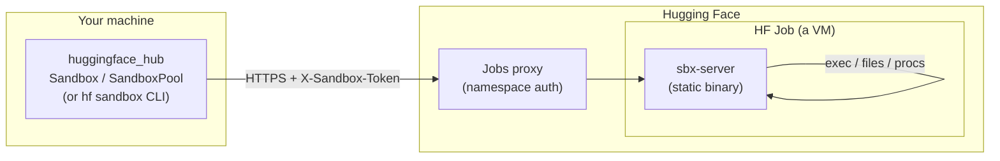
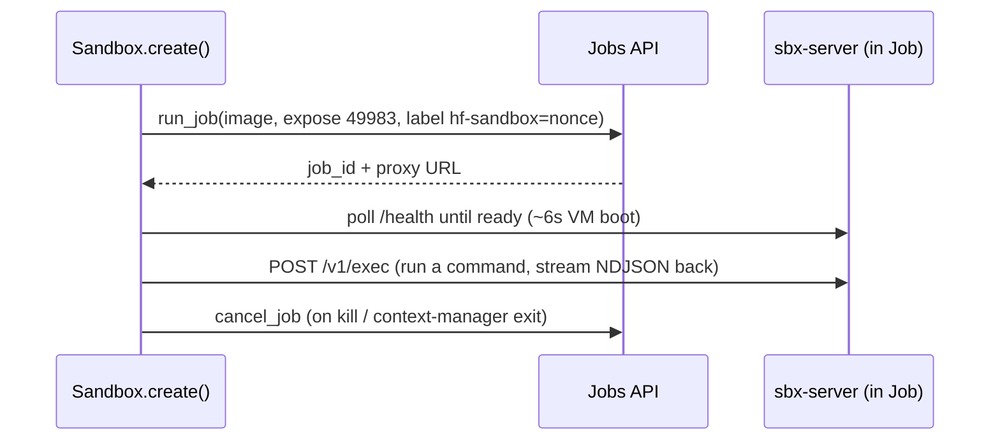
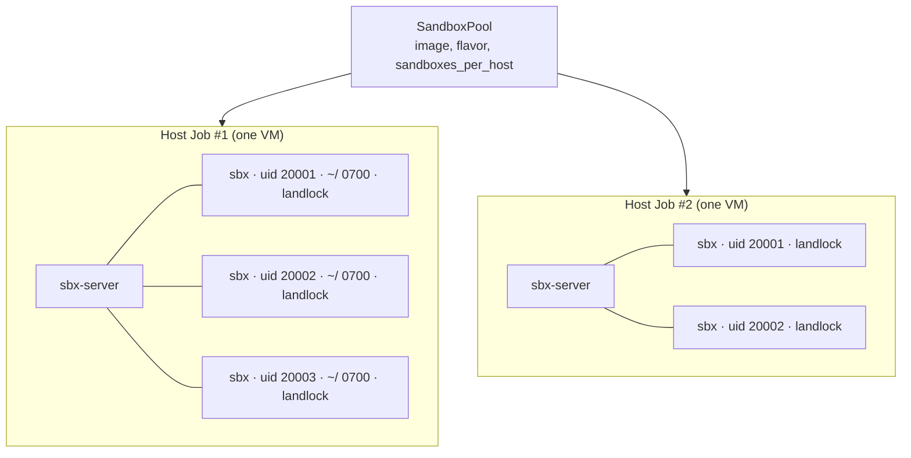
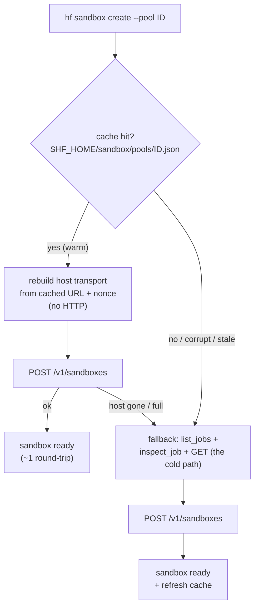

# Sandboxes on HF Jobs — how it works

> A **sandbox** is an isolated cloud machine you can run commands in, stream output from,
> and copy files to/from — built entirely on top of [HF Jobs](https://huggingface.co/docs/huggingface_hub/guides/jobs).
> This doc is the 5-minute tour: what a sandbox is, the two flavors, and what happens
> under the hood. For the deep dives see [`DESIGN.md`](DESIGN.md) (dedicated),
> [`HOST_MODE.md`](HOST_MODE.md) (pools/landlock) and [`BENCHMARKS.md`](BENCHMARKS.md).

## The one thing to understand first

There is **no sandbox service**. A sandbox is just an HF Job (a VM) running one small
static binary — `sbx-server` — that speaks HTTP. The client talks to that server through
the **Jobs proxy** (the public `*.job.hf.space` URL the Job exposes). Everything else —
auth, discovery, packing — is built from Jobs primitives (labels, env vars, secrets).



At job startup the Job's command downloads the `sbx-server` binary (wget→curl→python3
fallback) and `exec`s it. The server listens on port **49983** (deliberately uncommon, so
your own ports stay free) and the Job exposes it. No Python, no pip — works in any image
with `/bin/sh`.

### Auth in one paragraph (it's stateless)

The per-sandbox token is `HMAC(your_hf_token, nonce)`, where `nonce` is a random public
string stored in the **job label** `hf-sandbox`. The server gets the token via a job
**secret**; the client re-derives it from the nonce on demand. So `Sandbox.connect(id)`
works from **any machine** holding the same HF token, with no local state — and your HF
token itself never enters the sandbox (unless you opt in with `forward_hf_token=True`).
The Jobs proxy independently enforces that only your namespace can reach the URL.

## Two flavors, one `Sandbox`

Both flavors hand you the same `Sandbox` object (`run`, `spawn`, `files.*`, `connect`,
`kill`). They differ only in **how the VM is allocated**:

| | `Sandbox.create` — **dedicated** | `SandboxPool` — **shared / pool** |
|---|---|---|
| mapping | **1 Job = 1 sandbox** (a whole VM) | **1 Job = N sandboxes** (one VM, many) |
| isolation | full VM | uid + **Landlock LSM** (same-user trust) |
| cold start | ~6s per sandbox | ~6s for the first host, then ~1 round-trip each |
| cost | one VM per sandbox | one VM per **host**, shared across `sandboxes_per_host` |
| GPU | ✅ | ❌ (CPU fan-out) |
| best for | GPU, untrusted code, one-offs | many cheap CPU sandboxes (RL rollouts, tool exec) |

Rule of thumb: **need a GPU or to run untrusted code → dedicated. Need 100s of cheap CPU
sandboxes → a pool.**

### Flavor 1 — dedicated (`Sandbox.create`)

One Job per sandbox: a full VM, strongest isolation, GPU-capable. `kill()` cancels the Job.



- **Drawbacks:** one VM per sandbox = one ~6s cold start and one VM billed each. A 1000-way
  fan-out means 1000 VMs.
- **Specifics:** routes live at `/v1/*`; paths are absolute on the container filesystem.

### Flavor 2 — pool / host mode (`SandboxPool`)

The fan-out case. One Job is a **host** that packs up to `sandboxes_per_host` sandboxes,
each isolated by a dedicated uid + a private `0700` home + a Landlock ruleset. Creating a
sandbox is `mkdir + chown + build ruleset` ≈ **1ms server-side** — no second VM boot. See
[`HOST_MODE.md`](HOST_MODE.md) for the isolation analysis.



A shared sandbox's public id is `<host_job_id>.<local_id>`, so `connect`/`exec`/`kill`
work statelessly just like dedicated ones. `kill()` on a shared sandbox sends a `DELETE`
to its host (freeing a slot) — the host keeps running.

- **Drawbacks:** same-user trust only (no cgroup DoS isolation; a sandbox can *see* — not
  touch — other PIDs). No GPU. Not for mutually-hostile code.
- **Specifics:** capacity is **server-authoritative** (the host replies `{"rejected": N}`
  when full and the client packs elsewhere); two-level idle eviction (per-sandbox + empty
  host). File paths are **rooted at the sandbox's private home**.

#### Pools have no authoritative local state

A pool *is* its running host Jobs, found via the `hf-sandbox-host` + `hf-sandbox-pool=<id>`
labels — so it's discoverable and reattachable from any machine, and it stops existing once
its last host is gone. The pool's config (image, flavor, density, idle timeout) lives in the
**host job's env vars**, read back when a client must boot a duplicate.

```bash
hf sandbox pool create --image python:3.12 --flavor cpu-basic   # warm 1 host -> pool id
hf sandbox create --pool <pool_id> --secrets K=v                # pack a sandbox onto a host
hf sandbox pool delete <pool_id>                                # terminate the pool's hosts
```

## The pool cache — why `create --pool` is fast

Because a pool keeps no authoritative local state, a cold `hf sandbox create --pool <id>`
must rediscover everything over the network before it can spawn a sandbox: `list_jobs`
(scan the namespace) → `inspect_job` each host (rebuild its URL + nonce) → `GET /v1/sandboxes`
each (how full is it?) → finally `POST` to create. Several round-trips of pure overhead per
CLI call — and each CLI invocation is a fresh process, so nothing is remembered.

A **best-effort cache** at `$HF_HOME/sandbox/pools/<pool-id>.json` fixes this. After any
`create`/`warm`, a process records the pool config + each host's URL, nonce and last-seen
free slots. The next process reads that file and goes **straight to the `POST`**:



Properties that make it safe to be sloppy:

- **Never a source of truth.** The in-job server is authoritative on capacity, so a stale
  `live` count only ever costs a wasted request, never correctness.
- **Self-healing.** A cached host that's gone is dropped on the first failed request and
  pruned from the file; the create falls back to label discovery transparently.
- **Concurrency-safe.** Writes merge under a file lock (by `job_id`) and commit atomically,
  so parallel `create` processes don't clobber each other and readers never see a half file.
- **Disposable.** Delete it, corrupt it, or run from a machine that's never seen the pool —
  it's a cache miss, the cold path runs, and everything still works. It is never shared
  across machines, by design.

The cache only ever makes things **faster, never slower**: the worst case (cold/stale) is
exactly the original label-discovery path.

## Where the code lives

| piece | where |
|---|---|
| `sbx-server` (Rust, static) | [github.com/Wauplin/sandbox-server](https://github.com/Wauplin/sandbox-server), binary on `Wauplin/sbx-server` |
| `Sandbox`, `SandboxPool`, `_SandboxServer` | `src/huggingface_hub/_sandbox.py` |
| pool cache (layout + locking) | `src/huggingface_hub/_sandbox_cache.py` |
| `hf sandbox` CLI | `src/huggingface_hub/cli/sandbox.py` |
| tests (fake in-process server) | `tests/test_sandbox.py` |
